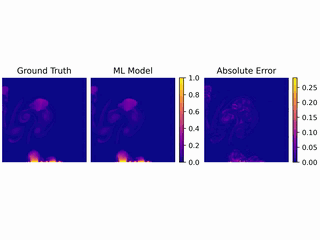

# BubbleML

[](https://arxiv.org/abs/2307.14623)

A multi-physics dataset of boiling processes.  
This repository includes downloads, visualizations, and sample applications.



This dataset can be used to train operator networks, act as a ground truth for Physics-Informed Neural Networks, or train computer vision models.
These models have applications to cooling systems for datacenters (I.e., liquid cooling flowing across a GPU) or even cooling nuclear reactors (I.e., a pool of liquid sitting on a heated surface).

This repository provides baselines and sample applications for the bubble ML dataset. Sample videos can be seen in [video](video/) directory. 

## Dataset Downloads

The dataset is hosted on AWS. Each boiling study can be downloaded separately.

| Study | Size |
|-----------------------|----|
| [Single Bubble](https://bubble-ml-simulations.s3.us-east-2.amazonaws.com/single-bubble.tar.gz)     | 503.0 MB |
| [Pool Boiling Saturated](https://bubble-ml-simulations.s3.us-east-2.amazonaws.com/pool-boiling-saturated-fc72-2d.tar.gz)      | 24.4 GB |
| [Pool Boiling Subcooled](https://bubble-ml-simulations.s3.us-east-2.amazonaws.com/pool-boiling-subcooled-fc72-2d.tar.gz)      | 10.5 GB |
| [Pool Boiling Gravity](https://bubble-ml-simulations.s3.us-east-2.amazonaws.com/pool-boiling-gravity-fc72-2d.tar.gz)        | 16.5 GB |
| [Flow Boiling Inlet Velocity](https://bubble-ml-simulations.s3.us-east-2.amazonaws.com/flow-boiling-velscale-fc72-2d.tar.gz) | 11.4 GB |
| [Flow Boiling Gravity](https://bubble-ml-simulations.s3.us-east-2.amazonaws.com/flow-boiling-gravity-fc72-2d.tar.gz)        | 10.9 GB |
| [3D Pool Boiling Earth Gravity](https://anl.app.box.com/s/wwj2f9b0t2eetjmieoj163axmxctuswd)    | 140.7 GB |
| [3D Pool Boiling Low Gravity](https://anl.app.box.com/s/vnsfq59k9gnkhxyhhrc48sjwj61sjnia/) | 71.5 GB |

## Model Checkpoints

The model checkpoints are organized based on the dataset they were trained on. So,
each link contains checkpoints FNO, UNO and UNet.

| Models | Size |
|----|----|
| [Flow Boiling Gravity Models](https://bubbleml-model-checkpoints.s3.us-east-2.amazonaws.com/fb_gravity.tar.gz) | 237.0 MB |
| [Pool Boiling Saturated Models](https://bubbleml-model-checkpoints.s3.us-east-2.amazonaws.com/pb_saturated.tar.gz) | 208.9 MB |
| [Pool Boiling SubCooled Models](https://bubbleml-model-checkpoints.s3.us-east-2.amazonaws.com/pb_subcooled.tar.gz) | 208.9 MB |

## Environment Setup
The code assumes access to a fairly modern Nvidia GPU, though
it may also work on AMD GPUs if PyTorch is installed with Rocm support.
Results have been reproduced on a Linux cluster with V100, A30, and A100 GPUs using PyTorch 2.0 and CUDA 11.7.

To install dependencies, we recommend creating a conda environment:

```console
conda env create -n bubble-sciml -f conda/pytorch-2.0.1-cuda-11.7.yaml
```

## Running Sample Code

The sample code uses Hydra to manage different configurations.
For example, we treat each simulation type as a dataset: `conf/dataset/*.yaml`.
Similarly, each model is treated as a separate experiment: `conf/experiment/*.yaml`.

For example, training a temperature prediction UNet model on the subcooled boiling dataset is simple:

```console
python src/train.py dataset=PB_SubCooled experiment=temp_unet2d
```

If you want to run a pretrained model, you can specify the `model_checkpoint` path

```console
python src/train.py dataset=PB_SubCooled experiment=temp_unet2d model_checkpoint=<path>
```

The config file `conf/default.yaml` assumes that the datasets are extracted to the same location.
**This location should be set by the user. By default, this setting is empty**.
Setting the `data_base_dir`  can be done by explicity updating `conf/default.yaml` or
specifying the dataset base directory when running the python scripts.) 

For example, if you downloaded two datasets to 

```console
/your/path/to/BubbleML/saturated.hdf5
/your/path/to/BubbleML/subcooled.hdf5
```

then, to train a UNet model on the subcooled boiling dataset, just run

```console
python src/train.py data_base_dir=/your/path/to/BubbleML dataset=PB_SubCooled experiment=temp_unet
```

## Citation

If you find this dataset useful in your research, please consider citing the following paper:

```bibtex
@article{hassan2023bubbleml,
      title={BubbleML: A Multi-Physics Dataset and Benchmarks for Machine Learning}, 
      author={Sheikh Md Shakeel Hassan and Arthur Feeney and Akash Dhruv and Jihoon Kim and Youngjoon Suh and Jaiyoung Ryu and Yoonjin Won and Aparna Chandramowlishwaran},
      year={2023},
      eprint={2307.14623},
      archivePrefix={arXiv},
      primaryClass={cs.LG}
}
```
