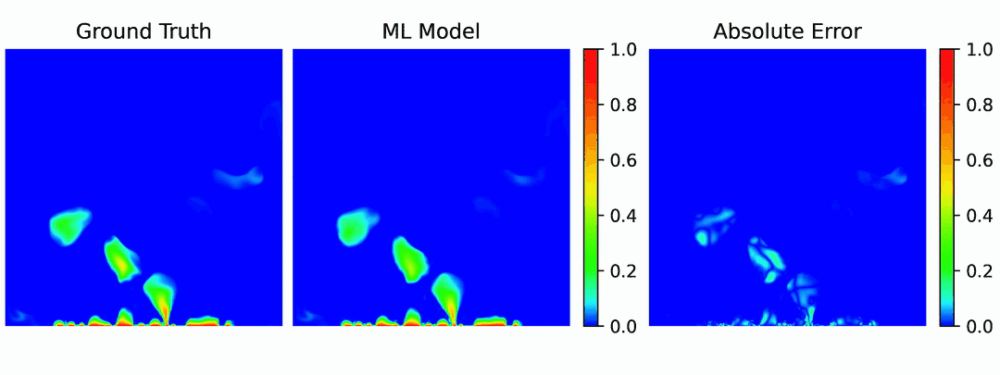
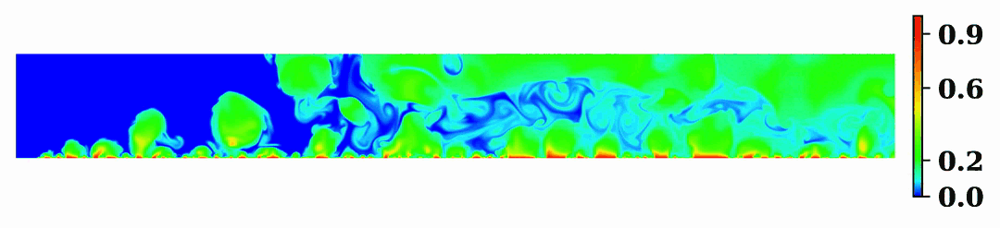

# Dataset GIFs

This shows some sample videos for different simulation types:

## Pool Boiling SubCooled

In this case, the liquid is below the boiling temperature.
As bubbles form and leave the surface, vapor trails are produced.
These vapor trails are very difficult to capture accurately with
machine learning models.

## Pool Boiling Saturated

Saturated boiling means the liquid is already hot. No vapor
trails are formed.

## Flow Boiling Inlet Velocity

This illustrates how changing the inlet velocity affects
flow boiling problems. With higher velocities, everything
obviously moves faster. This also means that errors in machine
learning models are more likely to get pushed out of frame.

#### Inlet Velocity of 1.0

#### Inlet Velocity of 2.0

#### Inlet Velocity of 4.0

